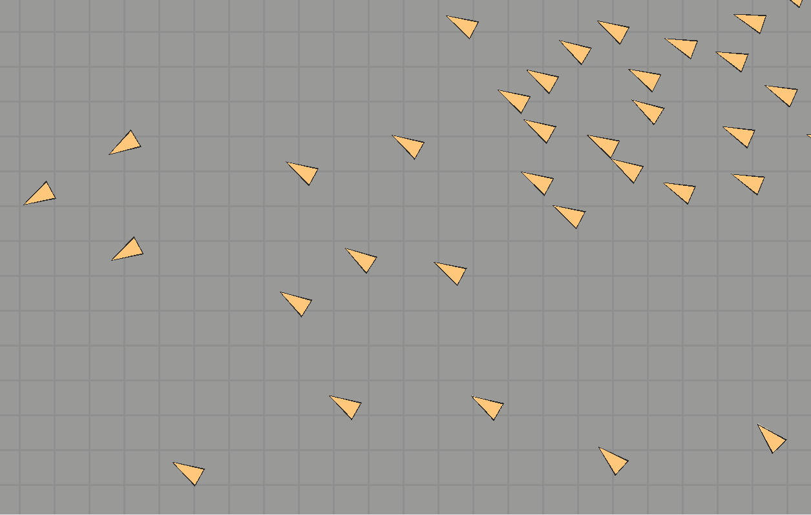

[README.md](https://github.com/user-attachments/files/33182396/README.md)
# Boids Simulation in 2D Unity

This is a project made for a course at Griffith Film School that simulates Boids in Unity in a 2D scene.

[](https://opensource.org/licenses/MIT)

## 📖 About The Project

This repository contains the Unity project **Boids-Project**.

Key features include The ability to simulate boids in a 2D environment with 4 sliders that change the way the boids move and how many boids are simulated. This project aims to deliver a Simplistic and educational look at how you can simulate boids in 2D Unity experience.



---

## 🚀 Getting Started

Follow these instructions to get a copy of the project up and running on your local machine for development and testing.

### Prerequisites

* **Unity Hub** installed.
* **Unity Editor** ([Specify Your Unity Version`6000.3.10f1 LTS`]). You can install it via Unity Hub.
* **Git** (for cloning the repository).
* An IDE for C# (like **Visual Studio** or **Visual Studio Code** with Unity integration).

### Installation

1.  **Clone the repository:**
    ```
    git clone [https://github.com/J-E-F/Boids-Project]
    ```
    (Alternatively, for private collaboration: or contact `Edvartjk@gmail.com` to be added as a contributor.)

2.  **Open the project in Unity Hub:**
    * Launch Unity Hub.
    * Click "Open" or "Add project from disk".
    * Navigate to the cloned `Boids-Project` folder and select it.

3.  **Open the project in the Unity Editor:**
    * Once added, click on the project name in Unity Hub to open it in the Unity Editor.
    * Unity will import assets and compile scripts. This might take a few minutes the first time.

4.  **Open the main scene:**
    * Once the editor is open, locate the main scene file (e.g., `Assets\Scenes.MainScene.Unity`) in the Project window and double-click it to open.

---

## ✨ Features

This project includes the following main feature:

### Feature: Boid Simulation with the ability to change the amount of boids, separation weight, cohesion weight and alignment weight.
* **Description:** Provides a simple and easy to understand boid simulation that uses the three rules made by Craig Reynolds in 2D space made with Unity.
* **Characteristics:**
    * Features 4 sliders that change the amount, separation, cohesion and alignment weight for the boids.
---

## 🛠️ Usage

After installation and opening the project in Unity:

Press the Play button in the Unity Editor to run the game, typically starting from the `Menu.unity` scene.

Key scene files include:

* `Assets/Scenes/Menu.unity`: Main menu and start screen.
* `Assets/Scenes/Game.unity`: Main gameplay scene.
* `Assets/Scenes/Credits.unity`: Displays the game credits.

Select GameObjects in the Hierarchy or Folders(e.g., 'FlockManager', 'Boid') to view and modify their properties in the Inspector window.

---

## ❓ FAQ

* **"I opened the project, but [specific problem, e.g., 'nothing happens when I press Play' or 'I see errors in the Console']."**
    * **Check the Console:** Look for error messages in Unity's Console window (Window > General > Console). These often indicate missing scripts, incorrect configurations, or compilation issues.
    * **Script References:** Ensure all public script fields in the Inspector that expect a reference (e.g., to another GameObject, Prefab, or Component) are correctly assigned.
    * **Unity Version:** Double-check that you are using a compatible Unity Editor version as specified in the Prerequisites.

---

## 🌿 Branches

This repository uses the following branches:

* **`main`**: Stable download of the project that has the main feature implemented and working.
---

## 🤝 Contributing

I am open to contributions and feedback.

If you have a suggestion that would make this better, please fork the repo and create a pull request. You can also simply open an issue with the tag "enhancement".
Don't forget to give the project a star! Thanks again!

1.  Fork the Project
2.  Create your Feature Branch (`git checkout -b feature/AmazingFeature`)
3.  Commit your Changes (`git commit -m 'Add some AmazingFeature'`)
4.  Push to the Branch (`git push origin feature/AmazingFeature`)
5.  Open a Pull Request

---

## 📜 License

Distributed under the MIT License. See `Copyright 2026.txt` for more information.
*(Consider adding a LICENSE.txt file with the MIT License text to your repository).*

---

## 📞 Contact

[Edvart] - [@jef-games.bsky.social](https://bsky.app/profile/jef-games.bsky.social) - [Edvartjk@gmail.com]

Project Link: [https://github.com/J-E-F/Boids-Project](https://github.com/J-E-F/Boids-Project)

---

## 🙏 Acknowledgements

* This project is associated with the [Griffith Film School](https://www.griffith.edu.au/arts-education-law/griffith-film-school) - [Bachelor of Games Design and Production](https://www.griffith.edu.au/study/degrees/bachelor-of-game-design-and-production-1697)
* Special thanks to [Dr Justin Carter](https://experts.griffith.edu.au/37511-justin-carter), [Dr Zac Fitz-Walter](https://experts.griffith.edu.au/35044-zac-fitzwalter), [Dr Josh Hall](https://experts.griffith.edu.au/41263-joshua-hall), [Henry Sun](https://www.linkedin.com/in/henrysunportfolio/)
